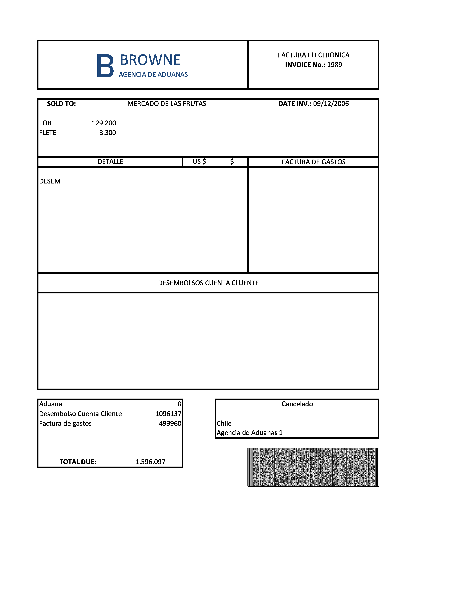

# Extractor de Metadatos de Facturas OCR

El siguiente código permite extraer los metadatos de una `factura escaneada` y almacenada en formato `.pdf`, por ejemplo:



|INVOICE|DATE|TOTAL DUE|
|--|--|--|
1989|09/12/2005|1.596.097

Para la extración se hace un preprocesamiento con `ImageMagick`, se convierten los caracteres a texto plano con `pytesseract`, luego, se utilizan expresiones regulares para extraer los metadatos y finalmente el resultado queda en formato json.

Para su funcionamiento se deben instalar las siguientes dependencias:

## Instalar ImageMagick en Red Hat 4.8.5-16.0.3

```Shel
yum update
yum install ImageMagick-devel
/usr/bin/yum --enablerepo epel-testing install tesseract.x86_64 tesseract-langpack-fra.noarch
```

Para la instalación en otras distribuciones, por favor revisa la [documentación oficial](https://docs.wand-py.org/en/latest/guide/install.html).

## Librerías python

Este código fué probado con `python3.6` y requiere instalar los siguientes paquetes:

```Shell
pip install -r requeriments.txt
```

## Referencias

- [Installing Tesseract-OCR on CentOS 6](https://stackoverflow.com/questions/23792373/installing-tesseract-ocr-on-centos-6)
